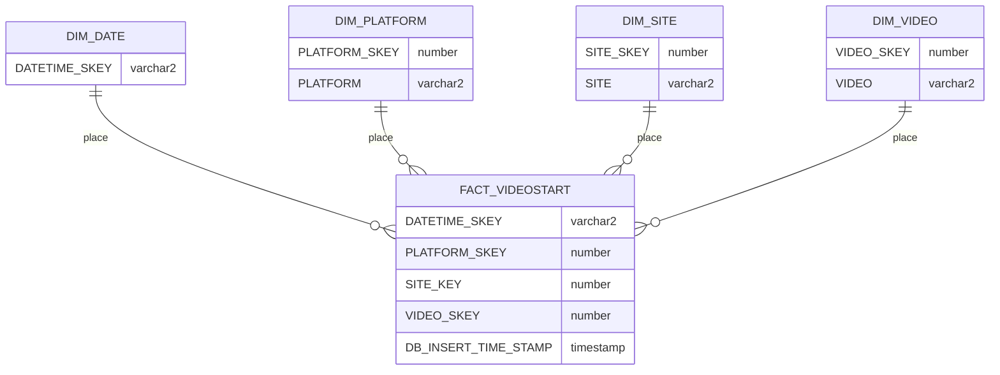

# VideoStarts Dimension Modelling and ETL Process

## Task Description:
Use this raw data (video_data.csv) and construct a star schema Data Warehouse which will be used to track video start time. Show the SQL queries you would use to populate the Data Warehouse Dimensions and Fact table.

## Brief Summary:

## Requirements: 

*VideoStart metric* 
- Determined from the “events” column containing “206”.
- All rows without 206 should be discarded.

***Dimensions***:
1. DimDate
2. DimPlatform
3. DimSite
4. DimVideo

*DimDate*:
- should go to the minute grain

*DimPlatform*:
- Split VideoTitle by pipe ‘|’.
- If VideoTitle.split(‘|’)[0] contains something that looks like a platform ('iPhone', 'Android' etc) then use that as the platform.
- If VideoTitle.split(‘|’)[0] doesn’t contain a platform but looks like a site, assume the platform is 'Desktop'.
- If VideoTitle.split(‘|’).count = 1, discard the row.

*DimSite*:
- Split VideoTitle by pipe |
- If VideoTitle.split(‘|’).count = 1, discard the row.
- If VideoTitle.split(‘|’)[0] looks like a site name, save the site name.

*DimVideo*:
- Last piece of VideoTitle.split(‘|’) contains the video title.
- You can ignore any middle pieces.

## Tools and Hardwares

**Tools**:
*Platform*: AWS RDS service, AWS S3 bucket, AWS EC2 instance
*Database*: MySQL
*Loading/Auditing*: sqlldr

**Infrastructure**:

## Table Design:

*VIDEOSTART_RAW* [1]:
|COL_NAME|DATA_TYPE|PK|NULLABLE|DATA_DEFAULT|COL_ID|COMMENTS|
|:---:|:---:|:---:|:---:|:---:|:---:|:---:|
|DATETIME|VARCHAR2(30 BYTE)|N|Y|Null|1|Data from raw file|
|VIDEOTITLE|VARCHAR2(200 BYTE)|N|Y|Null|2|Data from raw file|
|EVENTS|VARCHAR2(150 BYTE)|N|Y|Null|3|Data from raw file|

**DELTA TABLES**:

*VIDEOSTART_DLT* [2]:
|COL_NAME|DATA_TYPE|PK|NULLABLE|DATA_DEFAULT|COL_ID|COMMENTS|
|:---:|:---:|:---:|:---:|:---:|:---:|:---:|
|DATETIME|TIMESTAMP(6)|N|N|Null|1|Data reformatted from [1].DATETIME|
|PLATFORM|VARCHAR2(200 BYTE)|N|N|Null|2|Data derived from [1].VIDEOTITLE|
|SITE|VARCHAR2(200 BYTE)|N|N|Null|3|Data derived from [1].VIDEOTITLE|
|VIDEO|VARCHAR2(200 BYTE)|N|N|Null|4|Data derived from [1].VIDEOTITLE|

*DIMDATE_DLT* [3]:
|COL_NAME|DATA_TYPE|PK|NULLABLE|DATA_DEFAULT|COL_ID|COMMENTS|
|:---:|:---:|:---:|:---:|:---:|:---:|:---:|
|DATETIME|TIMESTAMP(6)|N|N|Null|1|Data reformatted from [2].DATETIME|

*DIMPLATFORM_DLT* [4]:
|COL_NAME|DATA_TYPE|PK|NULLABLE|DATA_DEFAULT|COL_ID|COMMENTS|
|:---:|:---:|:---:|:---:|:---:|:---:|:---:|
|PLATFORM|VARCHAR2(200 BYTE)|N|N|Null|1|Data derived from [2].PLATFORM|

*DIMSITE_DLT* [5]:
|COL_NAME|DATA_TYPE|PK|NULLABLE|DATA_DEFAULT|COL_ID|COMMENTS|
|:---:|:---:|:---:|:---:|:---:|:---:|:---:|
|SITE|VARCHAR2(200 BYTE)|N|N|Null|1|Data derived from [2].SITE|

*DIMVIDEO_DLT* [6]:
|COL_NAME|DATA_TYPE|PK|NULLABLE|DATA_DEFAULT|COL_ID|COMMENTS|
|:---:|:---:|:---:|:---:|:---:|:---:|:---:|
|VIDEO|VARCHAR2(200 BYTE)|N|N|Null|1|Data derived from [2].VIDEO|

---

**Dimension and Fact Tables**:

*DIMDATE* [7]:
|COL_NAME|DATA_TYPE|PK|NULLABLE|DATA_DEFAULT|COL_ID|COMMENTS|
|:---:|:---:|:---:|:---:|:---:|:---:|:---:|
|DATETIME_SKEY|VARCHAR2 (12 BYTE)|Y|N||1|Data derived from [3].DATETIME|

*DIMPLATFORM* [8]:
|COL_NAME|DATA_TYPE|PK|NULLABLE|DATA_DEFAULT|COL_ID|COMMENTS|
|:---:|:---:|:---:|:---:|:---:|:---:|:---:|
|PLATFORM_SKEY|NUMBER(38,0)|Y|N| |1||
|PLATFORM|VARCHAR2(200 BYTE)|N|N|null|2|Data derived from [4].PLATFORM|

*DIMSITE* [9]:
|COL_NAME|DATA_TYPE|PK|NULLABLE|DATA_DEFAULT|COL_ID|COMMENTS|
|:---:|:---:|:---:|:---:|:---:|:---:|:---:|
|SITE_SKEY|NUMBER(38,0)|Y|N| |1||
|SITE|VARCHAR2(200 BYTE)|N|N|null|2|Data derived from [5].SITE|

*DIMVIDEO* [10]:
|COL_NAME|DATA_TYPE|PK|NULLABLE|DATA_DEFAULT|COL_ID|COMMENTS|
|:---:|:---:|:---:|:---:|:---:|:---:|:---:|
|VIDEO_SKEY|NUMBER(38,0)|Y|N| |1||
|VIDEO|VARCHAR2(200 BYTE)|N|N|null|2|Data derived from [6].VIDEO|

*FACTVIDEOSTART*[11]:
|COL_NAME|DATA_TYPE|PK|NULLABLE|DATA_DEFAULT|COL_ID|COMMENTS|
|:---:|:---:|:---:|:---:|:---:|:---:|:---:|
|DATETIME_SKEY|VARCHAR2(12 BYTE)|N|N|Null|1|Data derived from [7].DATETIME_SKEY|
|PLATFORM_SKEY|NUMBER(38,0)|N|N|Null|2|Data derived from [8].PLATFORM_SKEY|
|SITE_SKEY|NUMBER(38,0)|N|N|Null|3|Data derived from [9].SITE_SKEY|
|VIDEO_SKEY|NUMBER(38,0)|N|N|Null|4|Data derived from [10].VIDEO_SKEY|
|DB_INSERT_TIME_STAMP|TIMESTAMP(6)|N|N|Null|5|TIMESTAMP when inserting the data|

---

### ER Diagram - STAR SCHEMA

